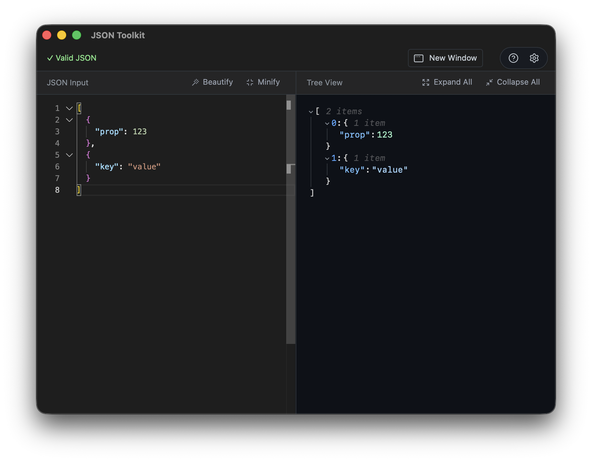

Get up and running with JSON Toolkit in just a few steps.

## Download the App

[Download JSON Toolkit from the Mac App Store](https://apps.apple.com/us/app/json-toolkit/id6755408881)

Once installed, launch JSON Toolkit from your Applications folder or Launchpad.

## Adding JSON

There are several ways to get JSON into the editor:

- **Paste:** Copy JSON from any source and paste it directly into the editor (`⌘V`)
- **Open a file:** Use **File → Open** (`⌘O`) to open a `.json` or `.jsonc` file
- **Type it:** Start typing JSON directly in the editor

The editor validates your JSON as you type, highlighting any syntax errors with inline markers.

## Viewing the Tree

Once your JSON is valid, the **Tree View** panel on the right automatically displays your data structure:

- **Expand/Collapse:** Click the arrows to drill into nested objects and arrays
- **Navigate:** The tree mirrors your JSON structure, making it easy to explore complex data
- **Visual feedback:** See your entire document hierarchy at a glance

The tree updates instantly as you edit, giving you real-time feedback on your changes.

## Next Steps

Now that you're set up, explore more features:

- [Features Overview](/jsontoolkit/features/overview) — Learn about beautify, minify, diff, and more
- [Product Overview](/jsontoolkit/intro) — Understand the full capabilities of JSON Toolkit
