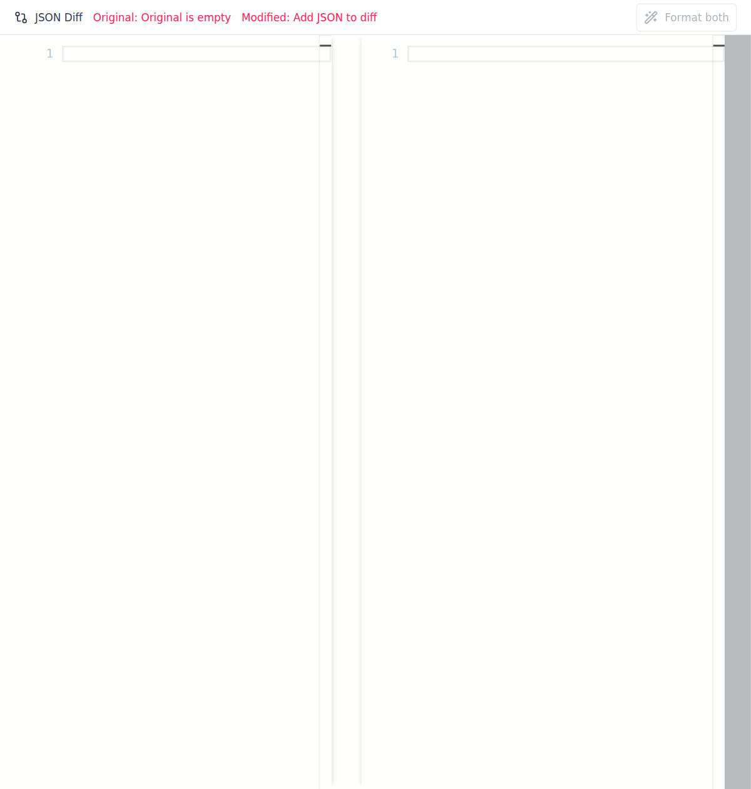
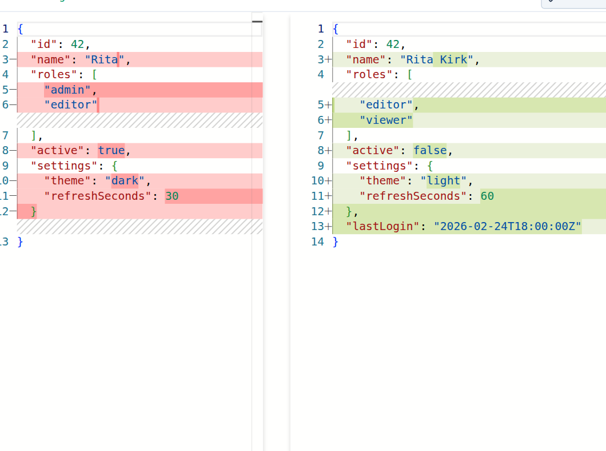

The Diff Viewer opens a dedicated side-by-side comparison workspace so you can review JSON changes without losing your main editor context.

## What it does

- Shows **original** (left) and **modified** (right) JSON side-by-side.
- Validates both sides independently and surfaces parse errors inline.
- Highlights additions, removals, and edits directly in the Monaco diff editor.
- Includes **Format both** to normalize valid JSON before review.

## Example: before and after

In the Mac app, open Diff Viewer from **File → Open Diff Viewer** (or press **Shift+Cmd+D**), then paste JSON into both panes.

After adding both versions, click **Format both** to normalize JSON on each side, then review the highlighted changes.

## Tips

- Keep related objects in the same order before diffing to reduce noise.
- Use **Format both** before final review so whitespace-only changes are minimized.
- If one side is invalid JSON, fix that side first to get accurate structural diffs.
