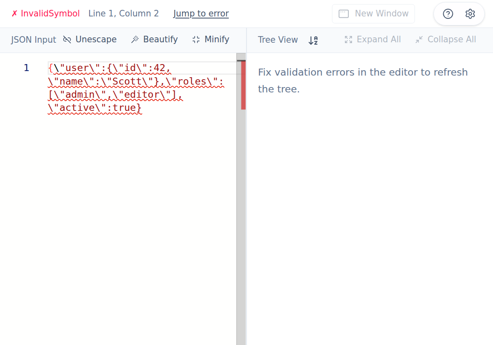
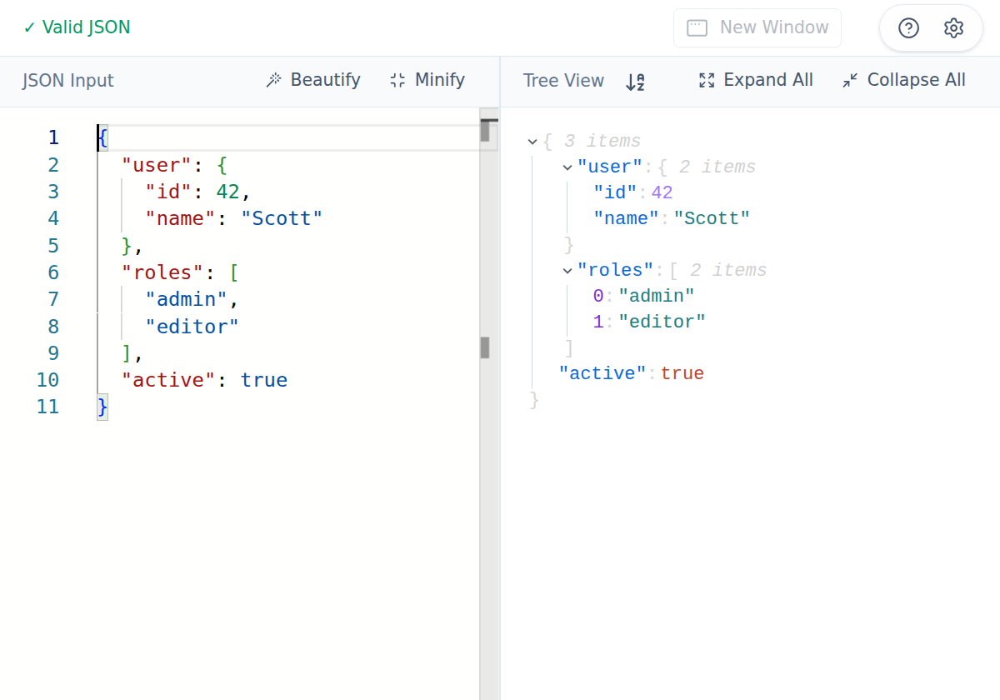

The editor toolbar is designed for quick cleanup and conversion workflows.

## Core actions

- **Beautify**: pretty-print valid JSON with consistent indentation.
- **Minify**: collapse valid JSON into compact one-line form.
- **Unescape**: appears automatically when the editor detects escaped JSON content.

### Example: escaped payload → editable JSON

When the input looks like an escaped payload, JSON Toolkit reveals **Unescape**.

After clicking **Unescape**, the payload is converted into normal editable JSON.

## Desktop menu companion

In the Mac app, **Edit → Escape JSON** and **Edit → Unescape JSON** provide the same conversion actions from the menu.
