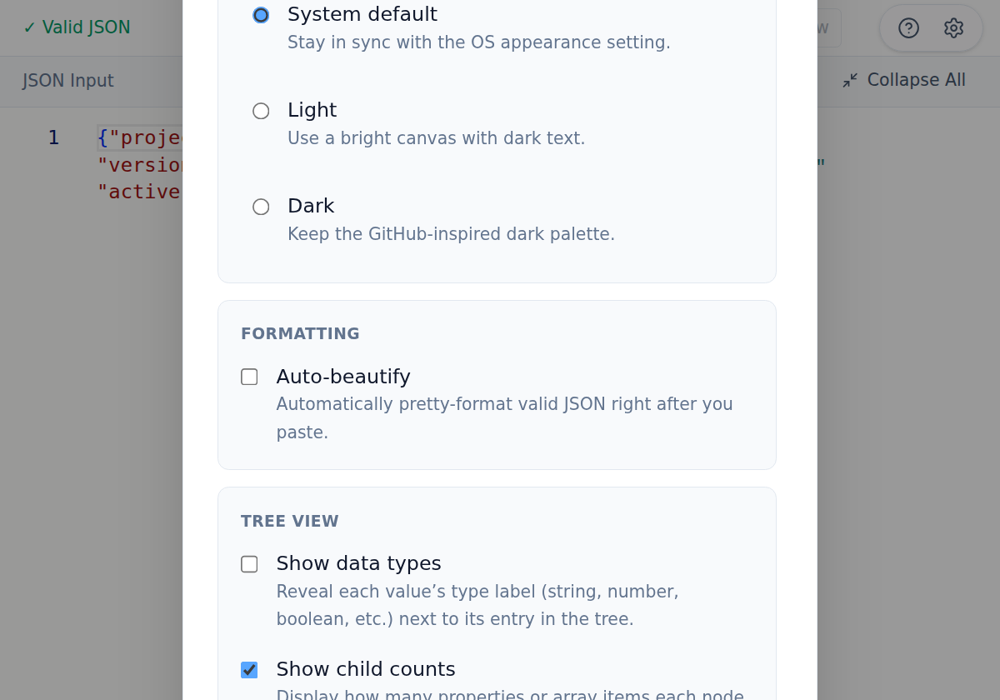

Open settings from the top-right gear icon to tune JSON Toolkit behavior.

## Key options

- **Appearance**: System / Light / Dark theme preference.
- **Formatting**: Auto-beautify pasted JSON.
- **Tree view**:
  - Show data types
  - Show child counts
  - Fully expand by default
  - Trim long strings

## Persistence

Settings are saved locally and restored automatically, including zoom level and theme preference.
